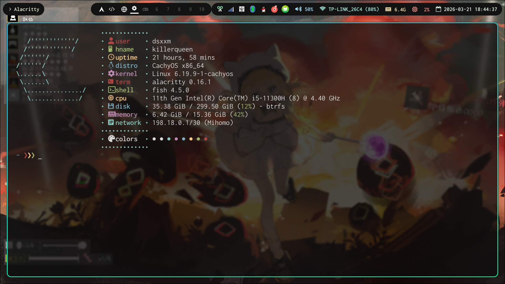

  <h1>🎨 Hyprland 桌面配置</h1>
  
仅作为个人备份，请谨慎copy以及提前做好备份，效果图如下

  
  

## 📋 项目简介

这是一个用于存放个人 Hyprland 桌面配置的备份仓库。通过 `update.sh` 脚本，可以方便地将本地配置同步到本目录进行版本管理。

> **⚠️ 重要提示**  
> 由于运行环境的差异，本配置仅供参考学习，请根据实际情况进行调整。

waybar和输入法（你可能需要更改主题）参考了这位老师的配置
>https://github.com/Isoheptane/dotfiles

